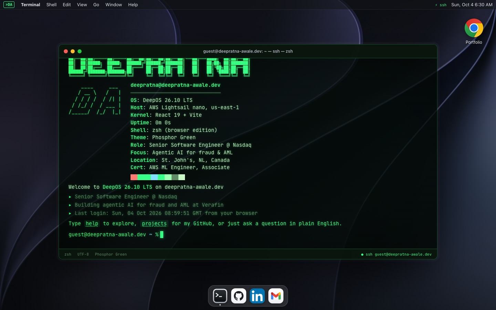
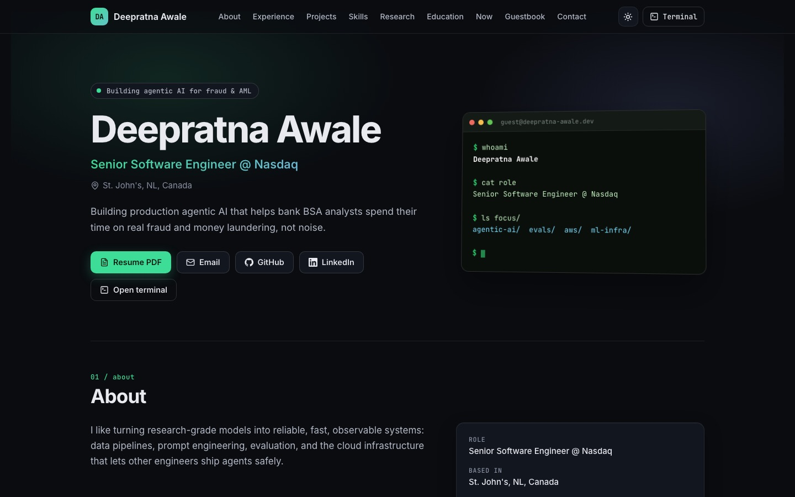

# terminal-portfolio

A personal portfolio that boots like an SSH session into a zsh terminal, with a
conventional portfolio page one click away. Live at
[deepratna-awale.dev](https://deepratna-awale.dev).





- **Terminal** at `/`: a zsh-like shell with tab completion, history, `vim`,
  pipes, themes, games and an assistant. Anything that is not a command is
  answered by Claude Haiku 4.5 on Amazon Bedrock, behind a Bedrock Guardrail.
- **Standard site** at `/gui`: the same content as a normal responsive page,
  prerendered for search engines and visitors without JavaScript.
- **Live data**: public GitHub repositories with README summaries, a GitHub
  contributions graph, and a guestbook.
- **Hosting**: one Docker container on AWS Lightsail (about $7 a month plus $1
  for the guestbook bucket), provisioned with Terraform and deployed by GitHub
  Actions through OIDC with no stored AWS keys.

MIT licensed. Fork it and make it yours: see [Deploy your own](#deploy-your-own).

## Local development

Working on the code with an AI agent (or new to it)? Start with [AGENTS.md](AGENTS.md).

Requires Node 22.

```bash
npm install
npm run dev
```

`npm run dev` starts Vite on http://localhost:5173 and proxies `/api` to the
Node server on port 8787; start that in a second terminal:

```bash
npm run api
```

Other scripts:

| Command | What it does |
| --- | --- |
| `npm test` | Vitest unit tests (shell, GUI parsing, server, S3 signing) |
| `npm run lint` | oxlint |
| `npm run build` | Type-checks, builds the client, server-renders and prerenders `/gui` into `dist/` |
| `npm run build && npm run api` | Serves the production build from the Node server on :8787 |

`fortune` and `cowthink` call the real binaries, so locally they need
`brew install fortune cowsay`; the container has them. To run the production
container:

```bash
docker build --platform linux/amd64 -t terminal-portfolio .
docker run --rm -p 8080:8080 terminal-portfolio
```

Without Bedrock credentials the assistant reports that it is offline and project
summaries fall back to the repository description. Without a guestbook bucket the
guestbook stores entries in a temporary file in development and is disabled in
production.

### Server environment variables

All optional; the deploy workflow sets the ones marked *deploy*.

| Variable | Default | Purpose |
| --- | --- | --- |
| `PORT` | `8787` (`8080` in the container) | Listen port |
| `ALLOWED_ORIGINS` | the `domain` from ABOUT.md, its `www` and localhost | Comma-separated origins allowed to call `POST` APIs |
| `AWS_BEARER_TOKEN_BEDROCK` | none (*deploy*) | Bedrock API key; the assistant is offline without it |
| `BEDROCK_GUARDRAIL_ID`, `BEDROCK_GUARDRAIL_VERSION` | none (*deploy*) | Guardrail applied to every call; the assistant is offline without them |
| `BEDROCK_MODEL_ID` | `us.anthropic.claude-haiku-4-5-20251001-v1:0` | Inference profile |
| `BEDROCK_REGION` | `us-east-1` | Bedrock runtime region |
| `CHAT_PER_MINUTE`, `CHAT_PER_DAY`, `CHAT_GLOBAL_PER_DAY` | 6, 60, 300 | Assistant rate limits (per visitor per minute, per visitor per day, overall per day). 300 a day costs at most about $2.50 |
| `GUESTBOOK_BUCKET`, `GUESTBOOK_ACCESS_KEY_ID`, `GUESTBOOK_SECRET_ACCESS_KEY` | none (*deploy*) | Lightsail bucket and bucket-scoped key |
| `GUESTBOOK_REGION` | `us-east-1` | Bucket region |
| `GUESTBOOK_PER_DAY`, `GUESTBOOK_GLOBAL_PER_DAY` | 3, 300 | Guestbook rate limits |
| `GUESTBOOK_FILE` | temp file in development | Local guestbook file |
| `GITHUB_OWNER` | `github` from ABOUT.md | Account whose repositories and contributions are shown |
| `GITHUB_TOKEN` | none | Optional token for a higher GitHub API rate limit |

## Architecture

```
Browser ──HTTPS──▶ Lightsail DNS ──▶ Lightsail container service (nano)
                                      └─ Node server (server/index.mjs)
                                         ├─ static client + prerendered /gui (dist/)
                                         ├─ /api/projects ─▶ GitHub API, Bedrock summaries (6 h cache)
                                         ├─ /api/contributions ─▶ GitHub
                                         ├─ /api/chat ─▶ Bedrock Converse + Guardrail
                                         ├─ /api/guestbook ─▶ Lightsail bucket (SigV4 signed in server/s3.mjs)
                                         └─ /api/fortune, /api/cowthink ─▶ binaries in the image

GitHub Actions (push to main)
  └─ OIDC ─▶ IAM role ─▶ build & push to ECR ─▶ new Lightsail deployment
```

| Path | Contents |
| --- | --- |
| `src/` | React 19 client: `components/` (terminal, menu bar, windows), `shell/` (line editor, completion, commands), `gui/` (standard portfolio page), `games/` |
| `ABOUT.md` | All site content and the assistant's facts (see [Make it yours](#make-it-yours)) |
| `shared/about.js` | Parses ABOUT.md for the client, the server and the build |
| `themes/` | One JSON file per colour theme, shared by the terminal and `/gui` (see [Themes](#themes)) |
| `server/` | Dependency-free Node server: static files, APIs, rate limits, Bedrock client, S3 signing |
| `scripts/prerender.mjs` | Renders `/gui` to static HTML at build time |
| `terraform/` | All AWS infrastructure; `terraform/bootstrap/` creates the state bucket |
| `.github/workflows/` | `ci.yml` (lint, test, build, Terraform validate) and `deploy.yml` |

The server has no runtime npm dependencies: it calls Bedrock with a bearer token
and signs S3 requests itself, so the image stays small and there is no AWS SDK.
Lightsail containers cannot assume IAM roles, which is why the assistant and the
guestbook each use a narrowly scoped long-lived key stored as a GitHub secret.

### Infrastructure

| Resource (`terraform/`) | Purpose |
| --- | --- |
| Lightsail container service | Runs the container (`nano` by default) |
| ECR repository | Private image registry; Lightsail pulls through its own role |
| Lightsail certificate | TLS for the apex and `www` |
| Lightsail DNS zone and records | Apex and `www` aliased to the service, certificate validation, SPF and DMARC records that reject mail spoofing the domain |
| IAM OIDC provider and deploy role | GitHub Actions pushes images and creates deployments without stored keys |
| Bedrock Guardrail and version | Content, prompt-attack, PII and topic filtering for the assistant |
| Lightsail bucket | Guestbook storage |
| AWS Budget (optional) | Emails you when monthly spend is forecast to pass `monthly_budget_usd` (set `budget_alert_email`) |

## Deploy your own

You need an AWS account, a domain you control, a GitHub account, and locally the
[AWS CLI](https://docs.aws.amazon.com/cli/), [Terraform](https://developer.hashicorp.com/terraform/install)
1.10 or newer, the [GitHub CLI](https://cli.github.com/) and Docker (optional,
for local container tests).

### 1. Fork and configure

Fork this repository, clone your fork, and replace the content with your own
(see [Make it yours](#make-it-yours)). Check `SECURITY.md` and `LICENSE` for the
name and contact details to change.

### 2. AWS prerequisites

1. Sign in with credentials allowed to manage Lightsail, ECR, S3, IAM roles and
   OIDC providers, and Bedrock guardrails in `us-east-1` (Lightsail DNS zones only
   exist there). An administrator is simplest for the first apply.
2. In the Bedrock console, make sure Anthropic's Claude Haiku 4.5 is available to
   your account (submit the Anthropic use-case form if Bedrock asks for it).
3. If the account already has a GitHub OIDC provider
   (`token.actions.githubusercontent.com`), import it before applying:
   `terraform import aws_iam_openid_connect_provider.github arn:aws:iam::ACCOUNT_ID:oidc-provider/token.actions.githubusercontent.com`.

### 3. Bootstrap Terraform remote state

```bash
cd terraform/bootstrap
terraform init
terraform apply                 # creates <prefix>-<account id>, versioned and encrypted
terraform output state_bucket
```

The bootstrap stack keeps its own state locally (it only owns one bucket that is
protected from deletion). Copy `terraform.tfvars.example` to `terraform.tfvars`
first to change the bucket prefix.

### 4. Configure and apply the main stack

```bash
cd terraform
cp backend.hcl.example backend.hcl            # set bucket to the state_bucket output
cp terraform.tfvars.example terraform.tfvars  # domain, name, repository
gh api repos/OWNER/NAME/actions/oidc/customization/sub
```

If that last command shows `"use_immutable_subject": true`, set
`github_immutable_subject_prefix` in `terraform.tfvars` to its `sub_claim_prefix`.
Both files are gitignored. Leave `attach_custom_domain = false` for now, then:

```bash
terraform init -backend-config=backend.hcl
terraform apply
```

### 5. Point the domain at Lightsail DNS

```bash
aws lightsail get-domain --region us-east-1 --domain-name example.dev \
  --query "domain.domainEntries[?type=='NS'].target" --output text
```

At your registrar (GoDaddy, Namecheap and so on), replace the domain's
nameservers with those four. Wait until the certificate is issued, which can take
from minutes to a few hours after the nameservers propagate:

```bash
aws lightsail get-certificates --region us-east-1 --certificate-name terminal-portfolio-cert \
  --query 'certificates[0].certificateDetail.status'
```

When it prints `ISSUED`, set `attach_custom_domain = true` in `terraform.tfvars`
and run `terraform apply` again to attach the domain and create the apex and
`www` records.

### 6. Bedrock key and guardrail

The guardrail is created by Terraform. The assistant's key belongs to an IAM user
that can do nothing except call one model and apply that guardrail:

1. In the IAM console, create a user (for example `terminal-portfolio-bedrock-chat`)
   with no console access and no attached policies.
2. Add an inline policy with the JSON from `terraform output -raw bedrock_chat_policy`.
3. On the user's Security credentials tab, generate an API key for Amazon Bedrock
   and paste it straight into the repository secret, so it never lands in a file:

   ```bash
   gh secret set BEDROCK_API_KEY -R OWNER/NAME
   ```

Changing the guardrail publishes a new version. Update the
`BEDROCK_GUARDRAIL_VERSION` variable (step 8) to the new `guardrail_version`
output and redeploy; old versions are kept so the running container keeps
working until then. To change what the assistant refuses, set
`guardrail_denied_topics` in `terraform.tfvars`. Denied topics are checked on
answers as well as questions, so a topic that overlaps your own work (for
example anti-money-laundering, if that is your job) will block ordinary answers
about it; put confidentiality rules in the assistant's instructions instead.

### 7. Guestbook bucket key

Terraform creates the bucket. Create its access key outside Terraform so the
secret never lands in state:

```bash
aws lightsail create-bucket-access-key --region us-east-1 \
  --bucket-name "$(terraform output -raw guestbook_bucket)"
```

Store the two values from the output as secrets, then clear your terminal:

```bash
gh secret set GUESTBOOK_ACCESS_KEY_ID -R OWNER/NAME
gh secret set GUESTBOOK_SECRET_ACCESS_KEY -R OWNER/NAME
```

The guestbook and the assistant are both optional: leave their secrets unset and
the site works without them.

### 8. GitHub environment, variables and first deploy

1. In the repository settings, create an environment named `production` and
   under Deployment branches and tags allow only `main`. The deploy role trusts
   only that environment and the `main` branch.
2. Set the repository variables from `terraform output github_actions_variables`:

   ```bash
   cd terraform
   terraform output -json github_actions_variables \
     | jq -r 'to_entries[] | "\(.key) \(.value)"' \
     | while read -r key value; do gh variable set "$key" -R OWNER/NAME -b "$value"; done
   gh variable set DEPLOY_ENABLED -R OWNER/NAME -b true
   ```

3. Push to `main` (or run the Deploy workflow by hand). The workflow builds the
   image, pushes it to ECR, creates a Lightsail deployment and waits until it is
   active.

| Name | Kind | Value |
| --- | --- | --- |
| `DEPLOY_ENABLED` | variable | `true` once the stack exists |
| `AWS_DEPLOY_ROLE_ARN` | variable | `github_deploy_role_arn` output |
| `AWS_REGION` | variable | `us-east-1` |
| `SERVICE_NAME` | variable | `service_name` (default `terminal-portfolio`) |
| `BEDROCK_GUARDRAIL_ID`, `BEDROCK_GUARDRAIL_VERSION` | variables | `guardrail_id`, `guardrail_version` outputs |
| `GUESTBOOK_BUCKET` | variable | `guestbook_bucket` output |
| `BEDROCK_API_KEY` | secret | step 6 |
| `GUESTBOOK_ACCESS_KEY_ID`, `GUESTBOOK_SECRET_ACCESS_KEY` | secrets | step 7 |

For a public fork, also turn on "Require approval for all external contributors"
under Settings, Actions, General, so workflows on outside pull requests wait for
you.

## Make it yours

Everything a visitor sees comes from one file, [`ABOUT.md`](ABOUT.md), plus the
images in `public/media/`. Edit it, run `npm run dev` to preview, and push.

**Frontmatter** (between the `---` lines) holds the profile and site settings:

| Key | Used for |
| --- | --- |
| `name`, `short_name`, `handle`, `initials` | Page titles, prompt (`guest@domain`), home directory, favicon and logo |
| `title`, `tagline`, `location` | Hero, neofetch, login banner |
| `email`, `domain`, `github`, `linkedin`, `source`, `resume` | Links, `open`, `email`, `resume`, GitHub projects and contributions, allowed origins |
| `seo` | Meta description and link-preview text for `/` and `/gui` |
| `os`, `os_version`, `motd`, `neofetch`, `ascii_logo` | The fake OS, login banner, `neofetch` rows and boot logo |
| `example_question` | The assistant example shown by `help` |
| `links` | Dock icons, desktop icons, Chrome new-tab shortcuts and `open <id>` targets (see below) |
| `focus_dirs`, `contact_heading`, `contact_note` | Standard-site hero card and contact block |
| `featured` | GitHub repositories shown under Projects, in order |
| `media` | Files in `public/media/` that `view` can show, with alt text |

`name`, `email`, `domain` and `github` are required; the rest are optional.
The format is a small YAML subset: `key: value`, `key: [a, b]`, an indented
`- item` list, an indented `key: value` map, or `key: |` for multi-line text.

**Sections.** Every `# Heading` in the body is a section, in order. Each one is:

- a terminal command named after the heading (`# Talks` becomes `talks`), listed
  in `help` and tab completion, and a file for `ls`, `cat`, `grep` and `vim`;
- a section of the standard site at `/gui`, with a nav link.

So adding a section is just adding a heading and some markdown. An optional
comment on the line after the heading sets the details:

```markdown
# Education & certifications
<!-- command: education | nav: Education | help: degrees and certifications -->
```

`command` overrides the command name (default: the heading in lowercase with
dashes), `nav` the nav label (default: the heading) and `help` the description
in `help`. A heading that matches a built-in command such as `ls` keeps the
built-in.

These section names have their own layouts and expect the format shown in
ABOUT.md: `about` (`**Label:** value` lines become facts), `experience`
(`## Role`, then `**Company** suffix [dates] | place`, then `- bullets`),
`skills` (`**Category**` followed by items separated by two spaces),
`publications` (`## Title`, a `Venue, year.` line, then links), `education`
(`**Degree**  School, year`, then a `Certifications` line and indented
certificates), `contact` (`label     value` rows), `projects` (live from GitHub;
the body is the intro line on `/gui`), `now` (an `Updated: <when>` line and
bullets) and `guestbook`. Any other heading renders as plain markdown.

**Links and icons.** Every dock icon, desktop icon and new-tab shortcut is an
entry under `links`; nothing about them lives in code:

```yaml
links:
  - id: github                 # optional; makes `open github` work
    name: GitHub               # label and tooltip
    url: https://github.com/you
    icon: github.svg           # a file in public/icons/, a /path, or short text like CV
    tile: true                 # optional: white dock tile behind a transparent logo
    color: "#d93025"           # optional: background for a text icon
    show: [dock, desktop, newtab]
```

Drop the image into `public/icons/` and add the entry. Links to pages of this
site (`/gui`) open in the in-site Chrome; mail links open the mail app; anything
else opens a new tab.

**Assistant.** The `# Assistant` section never appears on the site. Its
`## Rules` list is added to the assistant's rules, and anything else in it is
extra background. The assistant also reads every visible section, so it answers
from the same facts the site shows.

**Media.** Replace `public/media/` (résumé, profile and architecture images,
project thumbnails named `<repository>.jpg`), `public/og.png` (link preview),
`public/apple-touch-icon.png` and `public/media/golden-dark.jpg` (desktop
background). The favicon, `robots.txt` and `sitemap.xml` are generated from
ABOUT.md at build time.

The guardrail's refusal message and denied topics are set in
`terraform/terraform.tfvars` (`owner_name`, `guardrail_denied_topics`); see
step 6 of [Deploy your own](#deploy-your-own).

### Themes

Themes live in [`themes/`](themes), one JSON file each, and every file there is
picked up at build time: it shows in the terminal's `theme` list and tab
completion and in the standard site's theme picker. No code changes are needed.
The terminal and `/gui` share the visitor's choice.

```json
{
  "$schema": "./theme.schema.json",
  "name": "My Theme",
  "scheme": "dark",
  "colors": {
    "background": "#1e1e2e",
    "surface": "#313244",
    "foreground": "#cdd6f4",
    "muted": "#7f849c",
    "accent": "#cba6f7",
    "accent2": "#a6e3a1",
    "link": "#89b4fa",
    "command": "#f9e2af",
    "success": "#a6e3a1",
    "error": "#f38ba8"
  }
}
```

The file name (without `.json`) is the theme's id, so `themes/my-theme.json` is
`theme my-theme`. Only `background`, `surface`, `foreground`, `muted` and
`accent` are required; the rest fall back to sensible mixes. Colours can be hex,
`rgb()`, `hsl()` or `oklch()`. An optional `terminal` block overrides the
terminal window itself (`background`, `chrome`, `code`, `border`, `glow`), for
example to make it translucent over the wallpaper.

[tweakcn](https://tweakcn.com) and other shadcn theme exports work as-is: save
the registry JSON (the one with `cssVars.light` and `cssVars.dark`) into
`themes/`. Its dark palette becomes `<file>` and its light palette
`<file>-light`. CI checks every file against
[`themes/theme.schema.json`](themes/theme.schema.json), which editors also use
for autocomplete.

## Security

See [SECURITY.md](SECURITY.md) for how to report a vulnerability and how the
deployment is locked down.

## License

[MIT](LICENSE)
